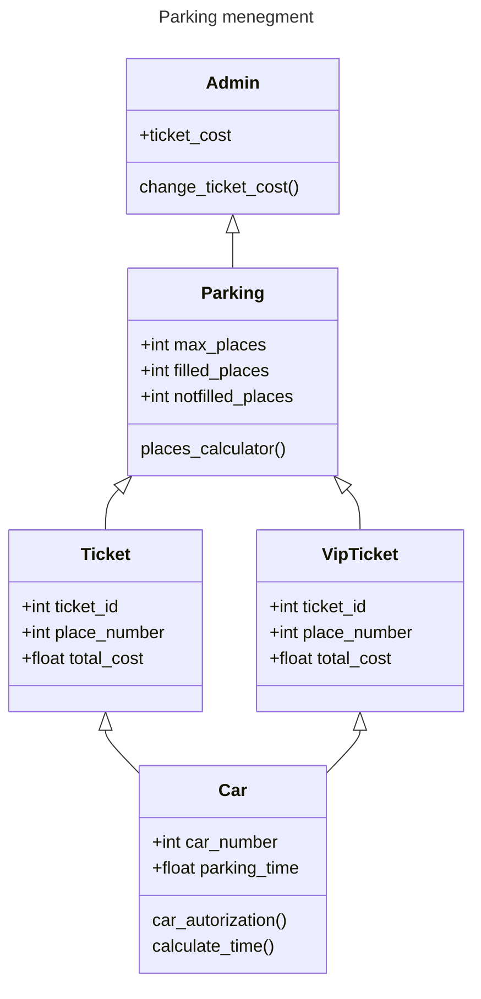

```mermaid
--- 
title: Parking menegment
---
classDiagram
    class Car
    Car : +int car_number
    Car : +float parking_time
    Car : car_autorization()
    Car : calculate_time()

    class Parking
    Parking : +int max_places
    Parking : +int filled_places
    Parking : +int notfilled_places
    Parking : places_calculator()

    class Ticket
    Ticket : +int ticket_id
    Ticket : +int place_number
    Ticket : +float total_cost
    
    class VipTicket
    VipTicket : +int ticket_id
    VipTicket : +int place_number
    VipTicket : +float total_cost
    
    class Admin
    Admin : +ticket_cost
    Admin : change_ticket_cost()

    Ticket <|-- Car
    VipTicket <|-- Car
    Parking <|-- Ticket
    Parking <|-- VipTicket
    Admin <|-- Parking
    
```